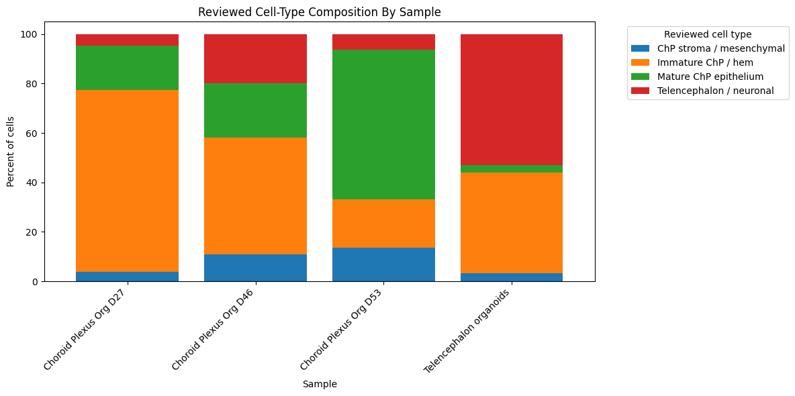
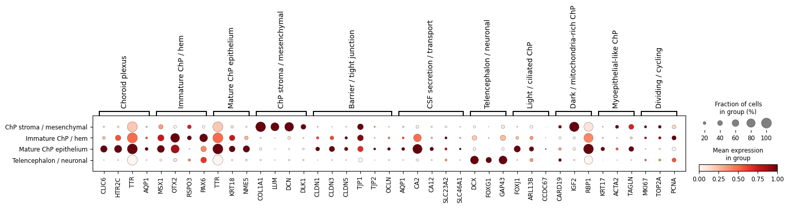

# GSE150903 Single-Cell Transcriptomics Reanalysis

This is my first computational biology portfolio project. I reanalyzed a public
single-cell RNA-seq dataset using Python and Scanpy, starting from an expression
matrix and building toward interpretable cell-type annotations and marker-gene
visualizations.

The analysis uses public data from
[GEO accession GSE150903](https://www.ncbi.nlm.nih.gov/geo/query/acc.cgi?acc=GSE150903),
associated with the study **"Choroid plexus organoids predict CNS drug
permeability and reveal human CSF proteins produced by specialized cell types."**

## Project Goal

The goal was not only to reproduce a figure, but to practice a complete
single-cell transcriptomics workflow on a published dataset and document the
reasoning behind each step.

In this notebook, I:

- loaded a gene-by-cell expression matrix into an AnnData object
- assigned sample metadata for telencephalon and choroid plexus organoid samples
- calculated quality-control metrics, including detected genes, total counts,
  and mitochondrial percentage
- filtered low-quality cells and rarely detected genes
- normalized counts, log-transformed expression values, and selected highly
  variable genes
- performed PCA, neighborhood graph construction, UMAP, and Leiden clustering
- inspected cluster composition by sample
- tested marker genes with Scanpy's Wilcoxon method
- added a more memory-efficient marker-gene workflow using sparse matrices and
  highly variable genes
- implemented a custom marker screen comparing in-cluster vs out-of-cluster
  expression
- visualized known choroid plexus, neuronal, stromal, ciliated, cycling, and
  transport-related marker genes
- scored clusters using marker-gene sets from the paper and related choroid
  plexus biology
- generated automatic cluster annotations
- reviewed/curated cluster labels and added final cell-type annotations
- summarized reviewed cell-type composition across samples
- generated a final marker dotplot using reviewed cell-type labels

## Key Outputs

### Reviewed Cell-Type Composition

This stacked bar chart summarizes the percentage of reviewed cell-type labels in
each sample.



### Marker Expression By Reviewed Cell Type

This dotplot shows selected marker genes grouped by biological category across
the final reviewed cell-type annotations. Dot size represents the fraction of
cells expressing a gene, and color represents scaled mean expression.



## What This Project Demonstrates

This project shows that I can move beyond running a single plotting command and
work through the main stages of a single-cell analysis:

- building an analysis-ready AnnData object
- using quality control to decide which cells and genes to retain
- reducing dimensionality and clustering cells
- comparing marker-gene strategies for biological interpretation
- using memory-aware approaches for larger single-cell matrices
- connecting computational clusters to biological cell-type labels
- creating publication-style summary visualizations
- organizing the work as a reproducible GitHub project

## Repository Structure

```text
.
├── README.md
├── data/
│   └── README.md
├── docs/
│   └── github_quickstart.md
├── notebooks/
│   └── gse150903_choroid_plexus_scrna_reproduction.ipynb
├── results/
│   └── figures/
│       ├── reviewed_cell_type_composition_by_sample.png
│       └── marker_dotplot_by_reviewed_cell_type.png
├── environment.yml
├── requirements.txt
└── .gitignore
```

## How to Reproduce

Create the conda environment:

```bash
conda env create -f environment.yml
conda activate gse150903-scrna
```

Or install the Python requirements:

```bash
pip install -r requirements.txt
```

Download the processed data from GEO and place it as described in
[data/README.md](data/README.md). Then open:

```text
notebooks/gse150903_choroid_plexus_scrna_reproduction.ipynb
```

Run the notebook from the repository root so relative paths such as
`data/processed/...` resolve correctly.

## Data Source

- GEO: [GSE150903](https://www.ncbi.nlm.nih.gov/geo/query/acc.cgi?acc=GSE150903)
- Organism: *Homo sapiens*
- Experiment type: expression profiling by high-throughput sequencing
- Samples: telencephalon organoids and choroid plexus organoids at days 27, 46,
  and 53

Large expression matrices and generated AnnData files are intentionally excluded
from GitHub. The data download instructions are documented in
[data/README.md](data/README.md).

## Notes

This project is a learning-focused reanalysis. The final annotations are based
on marker-gene scoring, automated cluster labels, and manual review, and should
be interpreted as a portfolio demonstration rather than a replacement for the
original publication's full analysis.
